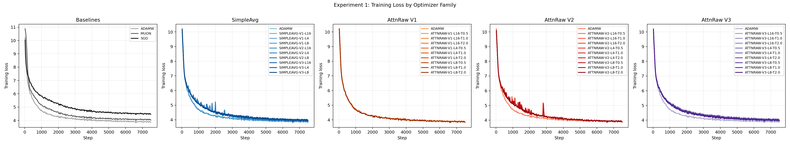
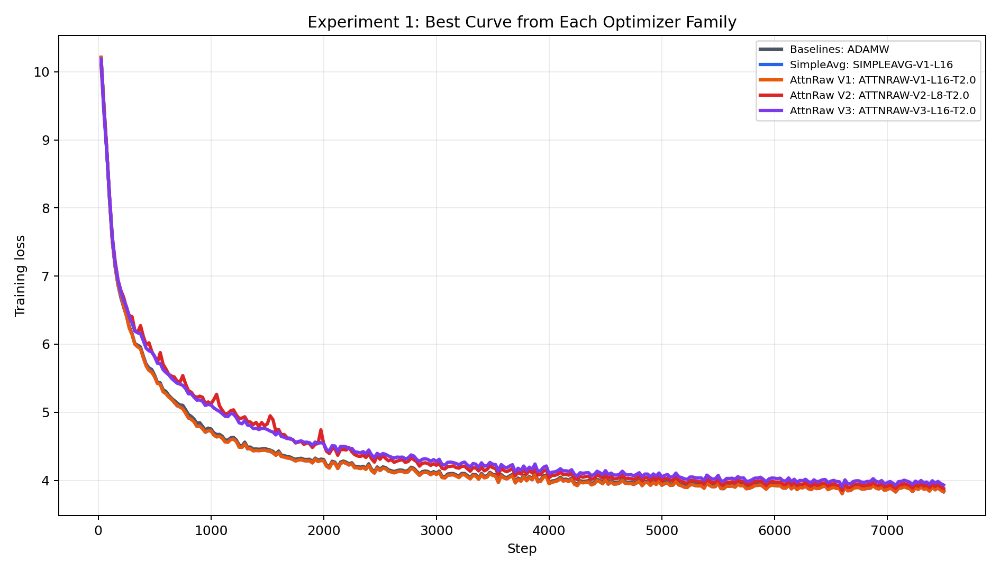
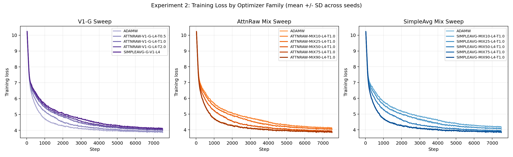
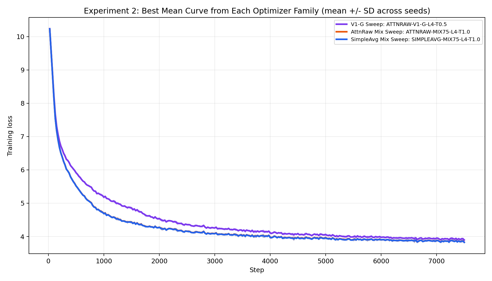

# Attention-Based Optimizers for Neural Network Training

## Motivation

[Attention Residuals](https://arxiv.org/abs/2603.15031) showed that replacing fixed residual connections with attention-based ones can improve performance.


Andrej Karpathy followed up with a [thought](https://x.com/karpathy/status/2033400893346107835) on whether stochastic gradient descent could also use attention in it:


That made me look at Adam's first-moment EMA differently: it compresses gradient history into a single exponentially decayed running average, much like a hidden state bottleneck in early sequential models.

The question becomes: instead of forcing optimization history through one fixed EMA, can an optimizer use attention to attend over recent gradients and decide what matters?

## AttnOpt: Tensorwise History Mixing

Adam's first moment is a fixed EMA of the current gradient:

$$m_t = \beta_1 m_{t-1} + (1 - \beta_1) g_t$$

This repo replaces the single-step gradient term with a tensorwise history-mixing term. For each parameter tensor, the current gradient vector attends over that tensor's own recent gradient history. There are no learned query/key projections at the moment: the attention scores are computed directly from cosine similarity and normalized with a softmax.

For a current gradient $g_t$ and a history window $[g_{t-1}, \dots, g_{t-L}]$:

$$s_i = \cos(g_t, g_{t-i}) = \frac{g_t \cdot g_{t-i}}{\|g_t\|\|g_{t-i}\|}$$

$$\alpha_i = \text{softmax}(s_i / T)$$

$$\text{attended} = \sum_{i=1}^{L} \alpha_i g_{t-i}$$

For the past-only variants, the mixed signal is:

$$\tilde{m}_t = \text{mix} \cdot g_t + (1 - \text{mix}) \cdot \text{attended}$$

with default `mix = 0.9`, i.e. 90% current gradient and 10% attended history.

## Optimizer Variants

The three AttnRaw variants differ only in how much optimizer state they retain.

Shared past-only AttnRaw definitions:

$$\text{attended} = \text{attention}(g_t, [g_{t-1}, \dots, g_{t-L}])$$
$$\tilde{m}_t = \text{mix} \cdot g_t + (1 - \text{mix}) \cdot \text{attended}$$

### AttnRaw-V1

Past-only attention, explicit current/history mix, EMA on both moments.

$$m_t = \beta_1 m_{t-1} + (1 - \beta_1) \tilde{m}_t$$
$$v_t = \beta_2 v_{t-1} + (1 - \beta_2) \tilde{m}_t^2$$

### AttnRaw-V2

Same mixed signal as V1, but fresh $m_t$ and EMA only on $v_t$.

$$m_t = \tilde{m}_t$$
$$v_t = \beta_2 v_{t-1} + (1 - \beta_2) \tilde{m}_t^2$$

### AttnRaw-V3

Same mixed signal for $m_t$, but no retained optimizer moments.

$$m_t = \tilde{m}_t$$
$$v_t = \beta_2 g_t^2 + (1 - \beta_2) \text{attended}^2$$

### AttnRaw-V1-G

This is the Experiment 2 variant that includes $g_t$ directly in the attention window instead of using an explicit mix.

$$\text{attended} = \text{attention}(g_t, [g_t, g_{t-1}, \dots, g_{t-L}])$$
$$m_t = \beta_1 m_{t-1} + (1 - \beta_1) \text{attended}$$
$$v_t = \beta_2 v_{t-1} + (1 - \beta_2) \text{attended}^2$$

No separate mix parameter is used in `V1-G`, because the softmax weights already decide how much $g_t$ contributes.

## SimpleAvg Baseline

`SimpleAvg` keeps the same optimizer structure as `AttnRaw`, but replaces softmax attention with a plain average over the history window. The past-only variants (V1/V2/V3) mirror AttnRaw V1/V2/V3 exactly — same past-only window, same explicit `mix` — so the only difference is averaging vs attention.

Shared past-only SimpleAvg definitions:

$$\text{attended} = \text{mean}([g_{t-1}, \dots, g_{t-L}])$$
$$\tilde{m}_t = \text{mix} \cdot g_t + (1 - \text{mix}) \cdot \text{attended}$$

with default `mix = 0.9`.

### SimpleAvg-V1

$$m_t = \beta_1 m_{t-1} + (1 - \beta_1) \tilde{m}_t$$
$$v_t = \beta_2 v_{t-1} + (1 - \beta_2) \tilde{m}_t^2$$

### SimpleAvg-V2

$$m_t = \tilde{m}_t$$
$$v_t = \beta_2 v_{t-1} + (1 - \beta_2) \tilde{m}_t^2$$

### SimpleAvg-V3

$$m_t = \tilde{m}_t$$
$$v_t = \beta_2 g_t^2 + (1 - \beta_2) \text{attended}^2$$

### SimpleAvg-V1-G

The direct counterpart to `AttnRaw-V1-G`: $g_t$ included in the window, plain average instead of attention. Added in Experiment 2 to isolate whether the attention weighting or the window structure is driving any difference.

$$\text{attended} = \text{mean}([g_t, g_{t-1}, \dots, g_{t-L}])$$
$$m_t = \beta_1 m_{t-1} + (1 - \beta_1) \text{attended}$$
$$v_t = \beta_2 v_{t-1} + (1 - \beta_2) \text{attended}^2$$

## Experiment Design

- **Model**: bias-free GPT, ~46.2M params, 6 layers, 8 heads, 512 dim, 1024 context
- **Dataset**: HuggingFace FineWeb
- **Training definition**: 7500 steps, 262,144 tokens/step, ~1.97B total tokens
- **History length sweep**: $L \in \{4, 8, 16\}$
- **Temperature sweep**: $T \in \{0.5, 1.0, 2.0\}$
- **Default seed**: 42
- **Checkpointing**: disabled by default to avoid filling local storage

### Experiment 1

Experiment 1 measures the effect of retained optimizer state.

- baselines: `ADAMW`, `MUON`, `SGD`
- `SIMPLEAVG-V1/V2/V3 × L4/L8/L16`
- `ATTNRAW-V1/V2/V3 × L4/L8/L16 × T0.5/T1.0/T2.0`

Goal:

- determine whether keeping both moments, only $v$, or neither is the main driver
- compare attention against the averaging baseline under the same state-retention pattern

Figures:

`assets/experiment_1_training_loss_by_optimizer.png` - grouped training-loss curves for baselines, SimpleAvg, and AttnRaw V1/V2/V3.



`assets/experiment_1_best_by_group.png` - best curve from each Experiment 1 category.



Top 5 by final loss:

| Rank | Run ID                | Final Loss | ADAMW Final Loss | Better Than ADAMW |
| ---: | --------------------- | ---------: | ---------------: | ----------------: |
|    1 | `SIMPLEAVG-V1-L16`    |   3.830743 |         3.852718 |          0.021975 |
|    2 | `ATTNRAW-V1-L16-T2.0` |   3.831524 |         3.852718 |          0.021194 |
|    3 | `ATTNRAW-V1-L8-T2.0`  |   3.831977 |         3.852718 |          0.020741 |
|    4 | `SIMPLEAVG-V1-L4`     |   3.832002 |         3.852718 |          0.020717 |
|    5 | `ATTNRAW-V1-L16-T1.0` |   3.832382 |         3.852718 |          0.020336 |

### Experiment 2

Experiment 2 focuses on the successful V1 family.

- `SIMPLEAVG-G-V1-L4` — averaging counterpart to V1-G
- `ATTNRAW-V1-G-L4 × T0.5/T1.0/T2.0`
- `ATTNRAW-MIX10/25/50/75/90-L4-T1.0`
- `SIMPLEAVG-MIX10/25/50/75/90-L4-T1.0`
- optional seed sweeps over `42, 67, 69`

Goal:

- test whether including $g_t$ in the attention window helps
- compare `SIMPLEAVG-G-V1-L4` vs `ATTNRAW-V1-G-L4-T1.0` directly: same window structure, averaging vs attention — isolates whether the cosine-similarity weighting does real work
- test how sensitive V1 is to the explicit current/history mix ratio
- measure whether the ranking is stable across seeds

Figures:

`assets/experiment_2_training_loss_by_optimizer.png` - grouped training-loss curves shown as mean +/- SD across seed sweeps.



`assets/experiment_2_best_by_group.png` - best curve from each Experiment 2 category.



Top 5 by mean final loss across seeds:

| Rank | Run ID | Mean Final Loss | ADAMW Mean Final Loss | Better Than ADAMW | Seeds |
|---:|---|---:|---:|---:|---:|
| 1 | `SIMPLEAVG-MIX75-L4-T1.0` | 3.826114 | 3.861710 | 0.035596 | 3 |
| 2 | `ATTNRAW-MIX75-L4-T1.0` | 3.828917 | 3.861710 | 0.032793 | 3 |
| 3 | `ATTNRAW-MIX90-L4-T1.0` | 3.843053 | 3.861710 | 0.018657 | 3 |
| 4 | `SIMPLEAVG-MIX90-L4-T1.0` | 3.844118 | 3.861710 | 0.017592 | 3 |
| 5 | `ADAMW` | 3.861710 | 3.861710 | 0.000000 | 3 |

## Rerun Layout

The current repo is set up for a clean rerun of the experiments.

```text
logs/
  experiment_1/
    <run_id>/metrics.jsonl
  experiment_2/
    seed_42/<run_id>/metrics.jsonl
    seed_67/<run_id>/metrics.jsonl
    seed_69/<run_id>/metrics.jsonl
```

Run ids are kept unchanged. Seed separation for Experiment 2 happens at the folder level, not by renaming runs.

## Future Directions

### AttnMeta (Meta-learned Projection Weights)

The main practical problem with this entire direction is that the empirical gain over `ADAMW` is real, but still fairly small relative to the systems cost. In the current runs, the best Experiment 1 result improves on `ADAMW` by about `0.57%`, and the best Experiment 2 result improves on the seed-averaged `ADAMW` baseline by about `0.92%`. Averaging those two best-case wins gives roughly a `0.75%` improvement over `ADAMW`.

That is promising, but it is not obviously large enough to justify the extra optimizer state and compute. Even the current history-based variants already require storing `n` additional gradient states, which means roughly `n * k` extra values for a model with `k` total parameters, on top of the usual optimizer state.

`AttnMeta` is the natural next idea: instead of using fixed cosine similarity, learn the history-compression rule itself. In that version, the optimizer would replace hand-crafted attention with a meta-learned projection learned through bi-level optimization:

$$q_t = f_\theta([g_t; m_{t-1}; v_{t-1}])$$

$$k_{t-i} = f_\theta([g_{t-i}; m_{t-i-1}; v_{t-i-1}])$$

$$a_{t,i} = \operatorname{softmax}\left(q_t k_{t-i}^T / \tau\right)$$

The meta-objective:

$$\min_\theta \; \mathbb{E}_{\text{task}} \left[L\left(\theta - \alpha \cdot u_\theta(g_{1:T})\right)\right]$$

where the inner update uses the attention mechanism and the outer meta-loss measures final task performance after several steps.

But this makes the practicality problem even worse. If each projection maps a `k`-dimensional tensor down to size `k / m` for some compression factor `m`, then even just the query and key projections already introduce on the order of:

$$2 \cdot k \cdot (k / m) = 2k^2 / m$$

additional learned parameters, before counting activation storage, optimizer state for those projection weights, and the extra matrix multiplications required at every optimizer step. In other words, even with compression, the added memory footprint and computation can still be enormous.

So the current conclusion is fairly skeptical: this line of work may have genuine promise because it did outperform `ADAMW`, but it is probably not a feasible drop-in replacement unless the memory and compute story improves substantially. Without better state compression, cheaper projections, more sharing across tensors, or some other way of reducing overhead, the gain does not yet look large enough to clearly justify the cost.

## Reproducibility

```bash
# Install dependencies
pip install -r requirements.txt

# Download data
python data/fineweb.py --max-shards 20

# Run a single experiment with the default training recipe
python train.py --run_id ATTNRAW-V1-L4-T1.0

# Run all of Experiment 1 sequentially
bash run_experiments.sh --experiment 1

# Run Experiment 2 seed sweeps sequentially
bash run_experiments.sh --experiment 2 --seeds 42,67,69

# Run all jobs in parallel across N GPUs
bash run_experiments_parallel.sh 4 --experiment all --seeds 42,67,69

# Analyze results
python analyze_results.py
```
