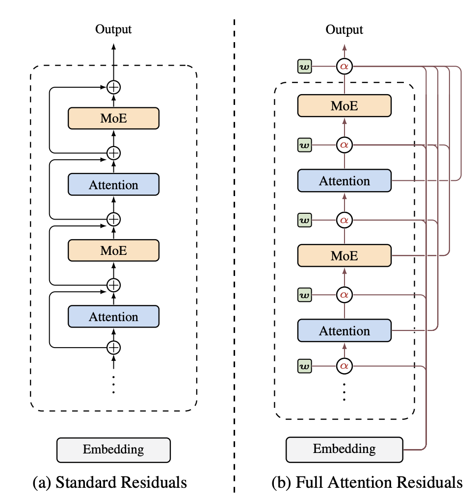

# Attention-Based Optimizers for Neural Network Training

## Motivation

[Attention Residuals](https://arxiv.org/abs/2603.15031) showed that replacing fixed residual connections with attention-based ones can improve performance.



Andrej Karpathy followed up with a [thought](https://x.com/karpathy/status/2033400893346107835) on whether stochastic gradient descent could also use attention in it:


That made me look at Adam's first-moment EMA differently: it compresses gradient history into a single exponentially decayed running average, much like a hidden state bottleneck in early sequential models.

The question becomes: instead of forcing optimization history through one fixed EMA, can an optimizer use attention to attend over recent gradients and decide what matters?

## AttnOpt: Tensorwise History Mixing

Adam's update rule uses an EMA of gradients as its first moment:

$$m_t = \beta_1 \ m_{t-1} + (1 - \beta_1) g_t$$

AttnOpt replaces that fixed decay with a learned, selective attention for each layer $\ell$ over a sliding window of the last $L$ gradients:

$$m_t^{(\ell)} = \beta^{(\ell)} g_t^{(\ell)} + \left(1-\beta^{(\ell)}\right)\sum_{i=1}^{L-1}\alpha_i^{(\ell)} g_{t-i}^{(\ell)}$$
$$\alpha^{(\ell)}=\text{softmax}\!\left(\left[s_1^{(\ell)},s_2^{(\ell)},\dots,s_{L-1}^{(\ell)}\right]\right)$$
$$s_i^{(\ell)}=\frac{q_t^{(\ell)}{k_{t-i}^{(\ell)}}^\top}{\sqrt{d_\ell}}, \qquad i\in\{1,\dots,L-1\}$$
$$q_t^{(\ell)} = g_t^{(\ell)} W_Q^{(\ell)}, \qquad k_{t-i}^{(\ell)} = g_{t-i}^{(\ell)} W_K^{(\ell)}, \qquad i \in \{1,\dots,L-1\}$$

We also test a no-parameter baseline using raw cosine similarity over gradient history:

$$s_i^{(\ell)} = \cos\!\left(g_t^{(\ell)},g_{t-i}^{(\ell)}\right), \qquad i \in \{1,\dots,L-1\}$$

## Experiment Design

- **Model**: nanoGPT ~44M (6 layers, 8 heads, 512 dim)
- **Dataset**: HuggingFace FineWeb
- **Training budget**: 2B tokens per run (~7,630 steps)
- **History length sweep**: $L \in \{4, 8, 16\}$
- **Temperature sweep**: $\tau \in \{0.5, 1.0, 2.0\}$ (for attention-based methods)

## Optimizer Variants

For each family, three variants test the role of retained optimizer state:

| Variant | Keeps $m_{t-1}$? | Keeps $v_{t-1}$? |
|---------|-------------------|-------------------|
| v1      | Yes               | Yes               |
| v2      | No                | Yes               |
| v3      | No                | No                |

| Optimizer          | Similarity Metric       | State Retention              |
|--------------------|-------------------------|------------------------------|
| AdamW              | N/A                     | $m + v$                      |
| SGD                | N/A                     | None                         |
| Muon               | N/A                     | $v$                          |
| AttnRaw-v1/v2/v3   | Cosine (raw gradients)  | v1: $m+v$, v2: $v$, v3: none |
| SimpleAvg-v1/v2/v3 | Uniform average         | v1: $m+v$, v2: $v$, v3: none |

**AttnRaw** computes attention scores directly from raw gradients. **SimpleAvg** replaces attention with uniform averaging over the same history window — a baseline to test whether the attention mechanism itself provides any benefit over naive history mixing.

## Results

**39 runs** completed on 2× GPUs. Winner: **AttnRaw-v1** — but the margin over SimpleAvg is negligible.

| Rank | Optimizer      | Final Loss |
|------|---------------|-----------:|
| 1    | AttnRaw-v1    |     3.8598 |
| 2    | SimpleAvg-v1  |     3.8608 |
| 3    | AdamW         |     3.8722 |
| 4    | SimpleAvg-v2  |     3.9088 |
| 5    | AttnRaw-v2    |     3.9480 |
| 6    | SimpleAvg-v3  |     4.0256 |
| 7    | Muon          |     4.0429 |
| 8    | AttnRaw-v3    |     4.1046 |
| 9    | SGD           |     6.1317 |

## Key Finding

**SimpleAvg ≈ AttnRaw** — the cosine attention mechanism barely outperforms simple momentum averaging. The real differentiator is keeping **both m and v in history**, not the attention mechanism itself.

Ordering by history state kept:
- **keep $m+v$** → best (AttnRaw-v1, SimpleAvg-v1)
- **keep $v$ only** → middle (AttnRaw-v2, SimpleAvg-v2)
- **keep neither** → worst (AttnRaw-v3, SimpleAvg-v3)

This suggests the attention mechanism itself is not the active ingredient — what matters is whether the optimizer retains access to its full gradient history state.

## Visualizations

See `assets/` for:
- `all_curves.png` — all optimizers overlaid
- `loss_curves.png` — grouped by optimizer variant
- `final_losses.png` — bar chart comparison
- `results_table.md` — full results table
- `summary_by_group.md` — group summary

## Caveats — How Real Are These Results?

These results are **preliminary** and should be interpreted with caution.

- **Model too small**: nanoGPT-44M vs production LLMs (GPT-3: 175B, Llama: 7B–70B)
- **Single seed**: All runs used seed=42 — results may be noise, not signal
- **Short training**: ~2B tokens (~1 epoch) — loss curves may not have plateaued
- **No LR tuning**: Hand-picked learning rates, no per-optimizer tuning
- **Batch size**: 262K tokens/step effective — Muon is known to be sensitive to this


## Future Directions

### AttnPrec (Preconditioned Cosine Attention)

AttnPrec would replace raw cosine similarity with **preconditioned** cosine similarity using second-moment normalization:

$g_t~ = g_t / (sqrt(v_{t-1}) + eps)$
$g_{t-i}~ = g_{t-i} / (sqrt(v_{t-i}) + eps)$
$s_i = cos(g_t~, g_{t-i}~)$

This normalizes gradient magnitudes before computing similarity, potentially making attention scores more robust to heterogeneous parameter scales across layers.

### AttnMeta (Meta-learned Projection Weights)

AttnMeta replaces hand-crafted attention with a **meta-learned projection** — learned via bi-level optimization to produce update directions tailored to the optimizer's actual loss landscape. Instead of computing attention scores from raw gradients, AttnMeta projects them through a learned network:

```
q_t = f_θ([g_t; m_{t-1}; v_{t-1}])
k_{t-i} = f_θ([g_{t-i}; m_{t-i-1}; v_{t-i-1}])
attention_score = softmax(q_t @ k_{t-i}^T / τ)
```

The meta-objective:

```
min_θ E_{task} [L(θ - α · attention_update_θ(g_{1:T}))]
```

where the inner update uses the attention mechanism and the outer meta-loss measures final task performance after several steps.

## Reproducibility

```bash
# Install dependencies
pip install -r requirements.txt

# Download data (20 shards = 2B tokens)
python data/fineweb.py --max-shards 20

# Run a single experiment
python train.py --run_id ATTNRAW-V1-L4-T1.0 --max_tokens 2000000000

# Run on 2 GPUs
CUDA_VISIBLE_DEVICES=0 python train.py --run_id <RUN_ID> --max_tokens 2000000000 &
CUDA_VISIBLE_DEVICES=1 python train.py --run_id <RUN_ID> --max_tokens 2000000000 &

# Analyze results
python analyze_results.py
```
